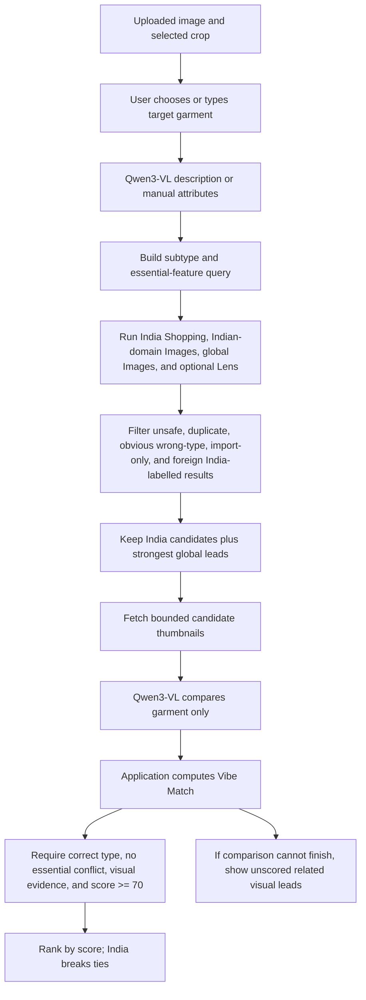

# The Better Wardrobe — Development Handoff

Last updated: 16 September 2026 (Asia/Kolkata)

This file is the continuation brief for another coding agent. Read it before changing the app. It describes the product intent, the current implementation, how to run it, what is real versus simulated, known problems, and the recommended next work.

## 1. Product in one paragraph

The Better Wardrobe is a mobile-first fashion companion for India with four primary experiences:

1. **Discover** — upload a screenshot, select a garment, describe/correct it, and find visually similar products. India-native shopping should be prioritised, while the strongest global visual match remains available as a clearly labelled fallback.
2. **My Wardrobe** — build a visual inventory of owned clothes and accessories from photos and later social sources.
3. **Style Me** — assemble looks from owned pieces, suggest missing pieces, and show the path from the current wardrobe to a desired look.
4. **Insights** — explain wardrobe value, wear, variety, cost, durability, and buying behaviour through modes such as Frugal, Splurge, YOLO, and Custom.

The central Discover promise is **“the exact vibe,” not a claim that a result is the exact original product**. Visual similarity, availability, price, and delivery are separate facts and must remain separate in the UI.

The intended audience is Gen Z and Gen Alpha. The visual language should be cool, editorial, minimal, fast, and expressive without becoming noisy or childish. The current palette is wine/maroon with rose-pink accents and editorial serif display type.

## 2. Read these files first

Product and design intent:

- `PRODUCT.md` — complete definition of Discover, My Wardrobe, Style Me, and Insights.
- `DESIGN.md` — design philosophy and tokens from the earlier design phase.
- `CONVERSATIONAL_FLOW.md` — product voice reference. It affects tone, not product intelligence.
- `prototype/DISCOVERY-WORKFLOW.md` — latest search pipeline, scoring, India strategy, fallbacks, and latency notes.
- `prototype/DISCOVERY.md` — provider setup, security boundaries, limitations, and historical integration notes.
- `prototype/README.md` — current walkthrough and local setup.
- `prototype/ASSETS.md` — asset provenance.

Original and supplied visual references:

- `mockup-reference/Better Wardrobe - Screens v2 Atelier.dc.html`
- `mockup-reference/Better Wardrobe - First Screens.dc.html`
- `/Users/ayanchoudhary/Downloads/Design system overview, seven screens.zip`
- `/Users/ayanchoudhary/Projects/the-better-wardrobe/Design Docs New/00-INDEX.md`
- `/Users/ayanchoudhary/Projects/the-better-wardrobe/Design Docs New/01-design-system.md`
- `/Users/ayanchoudhary/Projects/the-better-wardrobe/Design Docs New/02-app-shell-and-flows.md`
- `/Users/ayanchoudhary/Projects/the-better-wardrobe/Design Docs New/10-discover-frame-piece.md` through `15-discover-no-close-match.md`
- `/Users/ayanchoudhary/Projects/the-better-wardrobe/Design Docs New/20-wardrobe-add-sources.md` through `23-wardrobe-exploded-look.md`

The external design-doc paths were supplied by the owner and may require local filesystem permission. Use the supplied HTML and Markdown literally as the primary UI reference. The owner rejected earlier bland typography and a W-shaped logo, and specifically asked for the richer maroon/magenta direction.

## 3. Repository and file layout

Current working directory:

```text
/Users/ayanchoudhary/.codex/.chatgpt-projects/g-p-6aa776765344819196a3bf11d80db005
```

Important: **this directory is not currently a Git repository**. There is no `.git` directory here. Before substantial continued development, either:

- initialise Git here and make a baseline commit, or
- copy/move the working app into the owner’s canonical `/Users/ayanchoudhary/Projects/the-better-wardrobe` repository after confirming its existing state.

Do not assume rollback exists until Git is set up.

Runtime layout:

```text
prototype/
├── package.json
├── server.mjs                 # HTTP server and API boundary
├── lib/discovery.mjs          # provider calls, search, scoring, replay, telemetry
├── dist/
│   ├── index.html
│   ├── app.js                 # SPA state, routing, all four product tabs
│   ├── discovery.js           # uploaded-image Discover client flow
│   ├── developer.js           # developer dashboard client
│   ├── styles.css
│   ├── fonts.css
│   └── assets/                # local visual assets
├── scripts/start-local.sh     # starts project Ollama when needed, then the app
├── tests/
│   ├── discovery.test.mjs
│   ├── flows.test.mjs
│   └── server.test.mjs
└── .local-data/
    ├── discovery-replays.json # exact-input replay records; private/local
    └── ollama.log             # created when local launcher starts Ollama
```

The frontend is a dependency-free vanilla SPA. `dist/app.js`, `dist/discovery.js`, and CSS are compact/minified-style source files edited directly; there is no bundler or separate `src/` tree. Refactoring into readable modules is advisable before large feature work, but preserve behavior and tests while doing it.

## 4. Run and verify locally

From the project mirror:

```bash
cd /Users/ayanchoudhary/.codex/.chatgpt-projects/g-p-6aa776765344819196a3bf11d80db005/prototype
npm run local
```

Open on the Mac:

```text
http://127.0.0.1:5173
```

The server intentionally binds to `0.0.0.0`, so the main app can be opened on a phone on the same Wi-Fi. Determine the Mac’s current Wi-Fi address each time because DHCP can change it:

```bash
ipconfig getifaddr en0
```

Then open:

```text
http://<CURRENT_MAC_WIFI_IP>:5173
```

At the last check, the address was `192.168.1.4`, and the app successfully responded at `http://192.168.1.4:5173`. Do not treat that address as permanent. The mDNS alternative is usually:

```text
http://Ayans-MacBook-Air.local:5173
```

Phone requirements: same Wi-Fi, Mac awake, server still running, and no phone/Mac VPN isolating local traffic. The **Developer** API is deliberately localhost-only and therefore will not work from the phone; the normal app will.

Quick checks:

```bash
npm run check
npm test
curl http://127.0.0.1:5173/api/discover/status
```

Expected status shape (no secrets):

```json
{
  "vision": true,
  "visionProvider": "ollama",
  "shopping": true,
  "lens": true,
  "model": "qwen3-vl:2b",
  "developerDashboard": true,
  "dataMode": "auto"
}
```

`npm run local` expects the project-local Ollama binary and model under the workspace-level `.local-tools/ollama/` and `.local-models/ollama/` directories. If a system Ollama server is already listening on `127.0.0.1:11434`, the script reuses it.

## 5. Environment configuration

Secrets live in `prototype/.env`. Never commit, print, paste, or expose them to the browser. Use `prototype/.env.example` as the field reference.

Current configuration intent:

```dotenv
GEMINI_API_KEY=<optional cloud benchmark key>
GEMINI_MODEL=gemini-3.5-flash
VISION_PROVIDER=ollama
OLLAMA_BASE_URL=http://127.0.0.1:11434
OLLAMA_MODEL=qwen3-vl:2b
OLLAMA_TIMEOUT_MS=120000
SERPAPI_API_KEY=<required for uncached live search>
DISCOVERY_DATA_MODE=auto
DEVELOPER_DASHBOARD=true
PUBLIC_BASE_URL=<active HTTPS tunnel URL when Lens must fetch a crop>
DISCOVERY_HOURLY_LIMIT=20
```

Behavior of data modes:

- `auto` — replay an exact successful prior input; otherwise make live provider calls and record the result.
- `live` — always call providers.
- `replay` — never call providers; fail if no recording exists.
- `record` is also understood by the backend as a live-and-save mode.

The current ngrok URL may be stale and previously produced errors. Local network access does not require ngrok. Google Lens does require a provider-accessible HTTPS crop URL, so `PUBLIC_BASE_URL` must point at an active tunnel for the Lens route. Description-based SerpApi searches work without a tunnel.

Gemini free quota was exhausted during testing. The default was therefore moved to local **Ollama + Qwen3-VL 2B**, with Gemini retained only as an explicit benchmark. Do not silently fall back to a paid provider.

## 6. What currently works

### App shell and state

- Hash-based SPA navigation.
- Primary tabs: Discover, My Wardrobe, Style Me, Insights.
- Optional Developer tab behind `DEVELOPER_DASHBOARD=true`.
- Browser-local sample state, uploads, edits, saved inspiration, saved looks, wear logs, and reviews.
- Reset to sample data from the local-preview guide.

### Discover

- Upload JPG/PNG/WebP up to 10 MB.
- Choose or type a target garment, including custom values such as “suit.”
- Adjust the crop.
- Run local Qwen vision description or enter/correct attributes manually.
- Search Indian and global provider routes.
- Show search progress as real stages and elapsed time rather than a fake ETA.
- Compute Vibe Match only after visual assessment; show unscored fallback items as related visual leads.
- Preserve global matches as a fallback and retain a stronger global result even when India results exist.
- Save a live result as inspiration without treating it as owned.

### My Wardrobe

- Closed/open almirah presentation and category exploration.
- Upload up to five photos for a manual import-review flow.
- Sample extraction review, naming, categorisation, duplicate handling, and saving.
- Owned wardrobe versus saved inspiration.
- Edit/remove items, purchase price/date, wear logs, and condition reviews.
- The current upload flow does **not** perform live garment extraction.
- Instagram/social connection is an explanatory placeholder.

### Style Me

- Preset occasions, piece swaps, keep/lock, undo, before/after comparison, accessories, owned-only mode, saved looks, and wear logging.
- A small rule-based text box handles a few phrases such as work, beach/Kerala, date, accessories, or white tee.
- This is an outfit-board walkthrough, not AI styling or virtual try-on.

### Insights

- Frugal, Splurge, YOLO, and Custom views.
- Cost per recorded wear, spend, wears, variety, condition notes, and item drill-down.
- Inputs come from browser-local wardrobe and wear records.
- Analytics are deterministic prototype calculations, not an AI analytics service.

### Developer observability

- UI route: `http://localhost:5173/#developer`
- API: `GET /api/developer/observability`
- Visible only when `DEVELOPER_DASHBOARD=true`.
- API additionally checks that the Host header is localhost/loopback; it returns 404 over the LAN.
- Captures sanitised LLM/search request timings, failures, replay/cache usage, and search history.
- Does not return keys, uploaded images, or product URLs.

## 7. API surface

`prototype/server.mjs` exposes:

| Method | Route | Purpose |
|---|---|---|
| GET | `/api/discover/status` | Non-secret provider and feature status |
| POST | `/api/discover/analyze` | Describe selected garment from image |
| POST | `/api/discover/search` | Retrieve, assess, rank, and return matches |
| GET | `/api/discover/image/:token` | Temporary crop fetch for Lens; expires quickly |
| GET | `/api/developer/observability` | Localhost-only developer telemetry |

Analyze/search support NDJSON progress when requested by the client. The server serves only `prototype/dist/` as public static content.

Security/limits already present:

- API keys remain server-side.
- Request and decoded-image size caps.
- Temporary crop tokens use random identifiers and expire after five minutes.
- Temporary crops are held in memory and removed after search.
- Two simultaneous operations maximum.
- Shared hourly operation cap, default 20.
- Candidate URLs and image types are validated.
- Retailer-page fetches, when used by non-India paths, enforce public HTTPS destinations, redirect checks, size bounds, and timeouts.
- User text is escaped in the SPA.

## 8. Current Discover algorithm

The implementation is in `prototype/lib/discovery.mjs`. The latest conceptual description is in `prototype/DISCOVERY-WORKFLOW.md`.

High-level flow:



Vibe Match weights:

| Dimension | Weight |
|---|---:|
| Overall garment appearance | 35% |
| Shape and fit | 25% |
| Colour | 20% |
| Pattern | 10% |
| Defining details | 10% |

Unknown dimensions are omitted and weights are renormalised. Sparse evidence does not receive a score. Hard gates reject wrong garment types and defining conflicts. The score is an experimental visual similarity measure, not a calibrated probability or exact-product confidence.

Current India retrieval routes include:

- Google Shopping localised to India.
- Google Images with preferred Indian domains including Myntra, Ajio, Amazon India, Flipkart, Tata CLiQ, Nykaa Fashion, Louis Philippe, Van Heusen, Allen Solly, and Peter England.
- Unrestricted global Google Images in parallel.
- Google Lens when the crop has a working public HTTPS URL.

Import aggregators such as Desertcart/Ubuy and obvious foreign storefronts must not be labelled as India results. Global options may remain as global cards. If all provider results fail, the current code produces direct retailer search shortcuts for Myntra, Amazon India, and Flipkart rather than an empty page.

## 9. Known issues and risks

### Highest priority: India relevance

The owner has repeatedly seen US/global results for basic India searches such as a white shirt and denim trousers. This is unacceptable for the product promise. The current domestic-domain query and filtering are improvements, but they are not a validated production solution.

Problems to investigate:

- SerpApi may return weak, category, editorial, or overseas links despite India localisation.
- Google Shopping fields and Google Images fields vary; normalisation may discard useful thumbnails/merchant evidence.
- `domesticRetailer()` is a domain heuristic, not proof of domestic fulfilment.
- Query strings containing long detail phrases can over-constrain ordinary products.
- Local Qwen 2B can misdescribe fine details and may be slow on CPU.
- Candidate comparison can exceed the desired ten-second experience.
- A stale `PUBLIC_BASE_URL` disables or breaks Lens image retrieval.
- Retailer shortcuts are searches, not product matches; the UI must label them honestly.

Do not solve relevance by relabelling weak products, inventing scores, or suppressing the strongest global match. Build an evaluation set and measure the pipeline.

### Latency

The product target is under 10 seconds because users will abandon a minute-long wait. The current pipeline uses parallel retrieval and bounded timeouts, but strict visual comparison can still take longer than 10 seconds. The latest documented sample was approximately 9.9 seconds and may have benefited from provider caching; it is not p95 evidence.

Recommended architecture for responsiveness:

1. Return a first useful India/global result set quickly.
2. Stream enrichment and re-ranking as visual assessment finishes.
3. Cache/replay exact searches during iterative testing.
4. Avoid serial broadening and retailer-page scraping in the critical path.
5. Measure cold and warm p50/p95 by stage in the Developer dashboard.

### Frontend maintainability

The app is direct vanilla JavaScript in compressed single-line-heavy files. This was fast for a prototype but makes visual iteration risky. Before implementing large modules, split state, routes, views, discovery client, and components into readable source files with a small build step or clean ES modules.

### Persistence and accounts

There is no user account, production database, object storage, sync, authentication, or backup. Browser clearing removes state. Uploaded wardrobe photos may exceed localStorage. Personal styling photos are session-only.

### Claims and commerce

There is no cart integration, checkout, live PIN-code eligibility, selected-size availability verification, price freshness guarantee, affiliate tracking, or purchase confirmation. Links are retailer/search handoffs. Preserve honest labels.

### Visual QA

Automated browser visual testing was not completed. The owner has given updated Markdown design specs for Discover and My Wardrobe. Compare every implemented screen at mobile widths against those documents, especially typography, spacing, almirah motion, exploded wardrobe layout, and minimal number of taps/scrolls.

## 10. Tests and current confidence

Handoff baseline on 16 September 2026: `npm run check` passed and **all 33 tests passed**. The HTTP tests need permission to open a temporary loopback listener; a restricted sandbox can otherwise report `listen EPERM` even when the code is healthy.

Run:

```bash
cd prototype
npm run check
npm test
```

The suite covers:

- all walkthrough screens rendering;
- owned versus saved inspiration;
- wardrobe import edits and duplicate handling;
- Style Me swaps, keep, undo, and saved looks;
- wears, price edits, reviews, and Insights calculations;
- empty states, escaping, resets, and storage failure;
- Discover validation, ranking math, normalisation, metadata ambiguity;
- missing credentials and provider failures;
- local Ollama and Gemini request behavior;
- telemetry sanitisation;
- quota and retry behavior;
- India exclusion rules and stronger global fallback;
- slow-provider fallback and retailer shortcuts;
- replay recording;
- HTTP routes, feature gating, and streamed progress.

Tests use injected providers and do not prove live retailer relevance. Add evaluation tests around captured provider fixtures rather than spending SerpApi quota on every test run.

## 11. Recommended next roadmap

### Phase A — protect the current work

1. Establish the canonical Git repository and create a baseline commit.
2. Ensure `.env`, `.local-data/`, local models/tools, uploads, and logs are ignored.
3. Run the full test suite and record the baseline.
4. Verify the app on desktop and phone over LAN.

### Phase B — finish the design handoff faithfully

1. Read the supplied `Design Docs New` files in numerical order.
2. Build a token sheet from `01-design-system.md` and the supplied HTML: exact font families/weights, wine/magenta palette, spacing, radii, shadows, motion, and icon style.
3. Audit the app shell and Discover screens 10–15 against the specs.
4. Implement My Wardrobe screens 20–23, including the almirah open/closed state, exploded garment composition, and requested gamification.
5. Test at narrow mobile widths and reduce taps/scrolls.

Do not replace the approved style with a generic SaaS UI or Wearing clone. Do not bring back the rejected W logo.

### Phase C — make Discover measurable

Create a private evaluation set of at least 30–50 screenshots across:

- white shirts, denim, chinos, suits, dresses, outerwear, shoes, sunglasses, jewellery;
- plain and patterned items;
- cropped, occluded, dark, and multi-garment scenes;
- celebrity/screen references and ordinary product photos.

For each query, label:

- correct target category;
- essential visual features;
- top relevant India products;
- best global visual product;
- wrong-category rate;
- valid destination URL;
- India availability confidence;
- retrieval latency, comparison latency, total latency;
- number of SerpApi/LLM calls.

Track top-1/top-5 usefulness and “at least one actionable India result.” Do not tune against anecdotes alone.

### Phase D — strengthen India commerce retrieval

1. Inspect raw SerpApi payloads for successful and failed basic queries.
2. Separate retrieval adapters by source rather than forcing one generic normaliser.
3. Maintain an explicit Indian retailer/brand registry with domain, marketplace versus brand, import risk, and direct-product URL patterns.
4. Add query variants: precise visual query, simple commodity query, and retailer-specific query. Run a bounded subset in parallel.
5. Keep retrieval relevance separate from visual similarity and commerce availability.
6. Prefer direct product pages over category/search pages, while retaining clearly labelled retailer-search escape hatches.
7. Use global Lens/image results for visual truth and Indian inventory for actionability; show both when they serve different purposes.
8. Explore affiliate/product-feed APIs where available instead of relying indefinitely on scraping or generic web search.

### Phase E — production foundations

After product/design validation:

- readable frontend architecture;
- backend service separation and typed API contracts;
- user authentication;
- database for wardrobes, wears, reviews, saved looks, and search history;
- object storage for user images with explicit retention/deletion;
- background jobs for enrichment;
- provider circuit breakers, budgets, structured logs, and alerts;
- dev/staging/production environments;
- feature flags for Developer and experimental modules;
- privacy/consent flows for images and future Instagram access;
- analytics for upload → target confirmation → results → retailer click → saved/bought.

## 12. Product decisions that must remain intact

- Four primary tabs remain **Discover, My Wardrobe, Style Me, Insights**.
- Discover prioritises India, but does not hide a materially stronger global match.
- Empty/weak India inventory should degrade into useful related results and retailer searches, with honest labels.
- Vibe Match explains similarity; it does not claim exact-product identity.
- Saved inspiration is not automatically owned wardrobe.
- The app is an aggregation/personal wardrobe layer, not itself a marketplace.
- The design should be expressive, Gen Z/Alpha-friendly, editorial, maroon/magenta, and minimal in interaction cost.
- Developer observability stays feature-gated and hidden in shared demos.
- Local Ollama/Qwen is the default during extensive testing to avoid hosted-model quota; Gemini is optional benchmarking.
- Never introduce a paid fallback or billing requirement without the owner explicitly choosing it.

## 13. Suggested first Claude Code session

Use this sequence:

1. Read `HANDOFF.md`, `PRODUCT.md`, `DESIGN.md`, `prototype/DISCOVERY-WORKFLOW.md`, and all supplied numbered design docs.
2. Confirm the canonical repo and establish Git before editing.
3. Run `npm run check` and `npm test` from `prototype/`.
4. Start with `npm run local`; verify desktop and the current LAN URL.
5. Capture screenshots of every implemented route at a phone viewport.
6. Compare them against the numbered design specs and write a gap checklist.
7. Fix the design system/app shell and My Wardrobe 20–23 first, because the owner called those out explicitly.
8. Preserve the Discover API behavior while refactoring the frontend into readable modules.
9. Build the India-search evaluation fixture set before making further ranking changes.

Suggested kickoff prompt:

> Continue development of The Better Wardrobe using `HANDOFF.md` as the source of current implementation state, `PRODUCT.md` as product intent, and the supplied numbered design docs/HTML as the visual authority. First establish a safe Git baseline and run existing tests. Then audit the current mobile UI against the design docs, implement the missing My Wardrobe almirah/exploded-look flow faithfully, and preserve all Discover behavior and API security. Do not expose `.env` values, add paid provider fallbacks, or claim global items are India-available. After the UI work, create an evidence-based plan and fixture-backed evaluation for India search relevance and sub-10-second perceived latency.

## 14. Definition of a good continuation

The next iteration is successful when:

- the owner recognises the supplied design rather than a generic reinterpretation;
- My Wardrobe feels like the designed interactive almirah, including gamification and exploded views;
- basic India searches reliably yield at least one useful domestic option or an honest retailer-search route;
- the strongest global visual option remains visible and clearly labelled;
- initial useful content appears quickly, with longer enrichment continuing transparently;
- all existing tests pass and new behavior has meaningful fixture-backed coverage;
- secrets remain server-side and local developer tools remain hidden from shared users.
