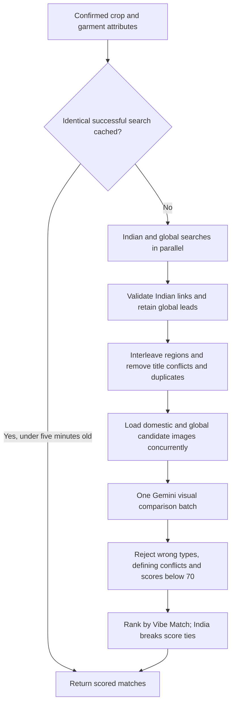
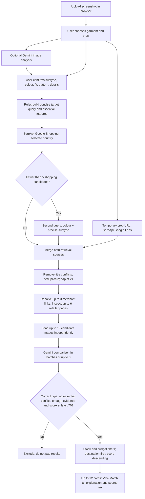

# Discovery v3: India latency and retailer changes

## Local model and replay testing

Development now defaults to Ollama with `qwen3-vl:2b`. Image description and candidate comparison run on the local Mac without a hosted LLM quota. Gemini remains available as an explicit benchmark provider. In `auto` data mode, each successful exact search is saved locally and replayed on subsequent identical requests; replay hits make no SerpApi, Lens or LLM calls. Recordings are capped at fifty and excluded from version control.

India searches now run two retailer-filtered Google Images queries concurrently through the existing SerpApi account. The first targets Myntra, Amazon India and Flipkart; the second targets Ajio and selected Indian brand storefronts including Louis Philippe, Van Heusen, Allen Solly and Peter England. An unrestricted global image route runs alongside them, and Google Lens joins when a public crop URL is available. A domestic-domain allowlist applies only to results labelled India; global results remain eligible and are clearly labelled. Desertcart, Ubuy and foreign storefronts cannot be presented as Indian options. An Indian domain is not proof of domestic dispatch; explicit import wording is rejected, but delivery still needs retailer confirmation.

No serial broader search, immersive shopping resolution or retailer-page scraping runs in the India critical path. A stronger global match is retained even when domestic matches exist; if India returns nothing, eligible global matches form the fallback result set. Global cards warn users to check import cost, delivery time and returns. Unknown price/stock remains unknown; no invented price or delivery guarantee. Image search may also return category pages, so these links are not claimed to be checkout-ready.

Fast provider routes have a 6.5-second deadline. If every fast route is empty or slow, Lens receives one rescue attempt with a 20-second window, followed by a broader global image search if Lens still returns nothing. When provider results exist but strict Gemini scoring cannot finish, the app returns up to six unassessed Lens/global items as **Related visual leads**. These cards do not show a percentage and are not represented as verified Vibe Matches. Candidates that Gemini actively rejected for the wrong garment or conflicting details are never reintroduced by this fallback.

The loader displays actual elapsed seconds and completed activity, without a fabricated percentage or ETA. Retrieval has a 6.5-second per-source timeout; image loading a two-second wait; comparison a twenty-second timeout. These bounds are not a ten-second performance guarantee. Successful searches are cached for five minutes, bounded to fifty entries. The cache is process-local and shared; hashes include the complete input, destination and budget.

Live verification: ordinary web retrieval took about two seconds but provided no scorable thumbnails, so it was replaced with image search. A cold image-search attempt took fifteen seconds and returned no scored matches because an eight-second comparison deadline was too short. That deadline was relaxed to twenty seconds and the shortlist reduced to four. Final live sample: **9,916 ms**, sixty retrieved links, four visual comparisons, two accepted matches. This reused the same search query as earlier probes, so provider caching may have helped. It is one successful measurement, not proof of cold-search or p95 performance below ten seconds. No paid fallback was introduced.

## Previous implementation reference

# Discover v2 — technical product workflow

This describes the code currently running, not a future architecture.

## What was wrong before

- Jacket was forced to stay Jacket even when image analysis described a vest.
- The broad fallback reduced the query to colour + generic category, losing the garment subtype.
- Only up to eight candidates were scored, while up to twelve could be shown. Unscored candidates were allowed onto the page.
- Wrong garment type and missing essential features had no hard rejection gate.
- A single failed candidate image could invalidate the entire comparison batch.
- The browser only showed a static sentence while waiting for all work to complete.

## Current input and interpretation

Browser: crop to the selected piece and resize the long edge to 1200 px. The optional Gemini call produces category, subtype, colour, fit, pattern, details and uncertainty. A sleeveless outer jacket can become Vest; the editable confirmation screen shows the change. No brand identification is asserted.

Backend rules identify essential features such as sleeveless construction, sherpa collar, camp collar, long or short sleeves. Query generation uses colour + subtype + essential features; the fallback keeps the subtype. A broad field such as Jacket with vest in the details resolves to vest for searching.

For the reported example, the query aims at **dark brown vest sleeveless sherpa collar**, rather than a generic **dark brown jacket**. A patterned SelfDesign vest conflicts with a plain reference; a full-sleeve jacket conflicts with a sleeveless target.

## Retrieval and verification

SerpApi supplies real links from Lens and Shopping. It does not guarantee shopping quality, identity or delivery. Country localisation is a retrieval preference, not shipping verification. Lens leads remain labelled global unless retrieved independently through local Shopping.

Candidates are interleaved between retrieval routes, deduplicated and capped at 24. At most three Google immersive-product lookups try to resolve merchant offers. Up to six retailer pages are checked for unambiguous Product JSON-LD. Unsupported or blocked pages stay unverified. Retailer requests are bounded; redirects and public IP destinations are validated. Selected size, PIN-code delivery, and import cost remain unverified.

## Vibe Match calculation

Gemini evaluates each candidate image against the selected reference and user-confirmed details. It is instructed to ignore background, person and other garments. It returns category compatibility, essential-feature conflict, per-dimension assessments and a reason. The backend—not the LLM—computes the final percentage.

| Dimension | Weight |
|---|---:|
| Overall garment appearance | 35% |
| Shape and fit | 25% |
| Colour | 20% |
| Pattern | 10% |
| Defining details | 10% |

`score = round(sum(dimension assessment × weight) / sum(observed weights) × 100)`

Each assessment is 0–1; unknown is null, not a match. Require at least 60% weight coverage, overall visual assessment ≥0.6, score ≥70, categoryMatch=true and essentialMismatch=false. All these gates must pass. Unassessed products are excluded. Price, popularity and affiliate economics do not contribute to the resemblance score.

Example: visual 0.9, fit 0.8, colour 0.9, pattern 1.0, details 0.7 yields **87% Vibe Match** after rounding. But a wrong garment category or an essential-feature conflict rejects the product regardless of that total.

The card exposes every dimension, its weight and assessment, plus the model’s observed differences. The percentage is an interpretable resemblance index; it is not a calibrated probability of exact identity or customer satisfaction. We have no embedding retrieval model or trained fashion classifier in this implementation.

## Loading and progress

The POST response can stream newline-delimited JSON. Backend progress events report milestones: 10% target confirmed, 40% retrieval complete, 50% checking links, 65% comparing images, up to 90% batches assessed, 100% result assembled. The browser renders a dedicated loading screen, stage label, percentage, progress bar and elapsed seconds. These percentages are stage weights, not precise compute-time fractions. No fabricated time-remaining promise is displayed. Cancel stops browser waiting; already-started provider work may finish.

## Quality evidence and next product gate

Regression tests cover the reported vest/category/pattern failure, missing image scores, rejection gates, subtype preservation, progress ordering and streamed responses. They prove rules execute, not that model relevance is production-grade.

For a production accuracy claim, collect at least 30–50 original garment references with the intended piece annotated, and have a human judge each returned top-five result. Track precision@5, searches with at least one useful result, wrong-type rate, missing-essential-feature rate, valid buying-link rate, destination verification, empty-result rate, p50/p95 latency and provider calls per query. A suggested release target is ≥80% top-five relevance and <5% wrong-type results, but this is a proposed target, not a measured achievement. Include low light, occlusion, multiple garments, men/women/accessories and different price bands.

Cost stays within configured free-provider access: no new provider, paid fallback or billing setting was added. A search can use up to six SerpApi requests and up to two Gemini comparison calls, plus the separately requested analysis call. Limits can stop progress; they must not silently switch to paid service.

## V2 live smoke check

A sample cream camp-collar shirt search streamed progress through the public ngrok link and completed in 97 seconds. It retrieved 30 candidates, removed six title conflicts, compared 16 images, and displayed 12 qualifying results with dimension breakdowns. A broader-search provider warning was retained. These are pipeline counts, not human relevance judgments. The supplied screenshots were used to construct vest/category/pattern regression cases; the original source photo was not available independently for an apples-to-apples retrieval benchmark.
