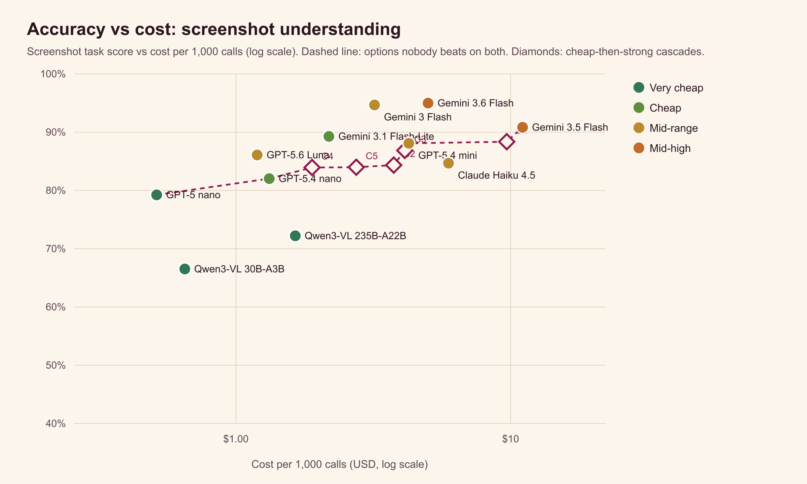
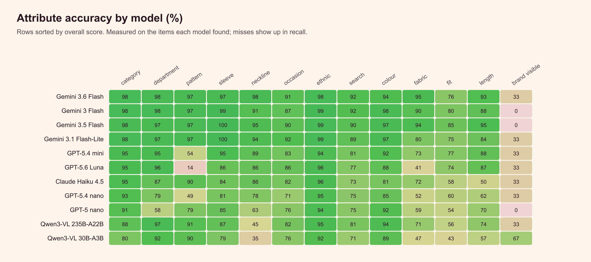
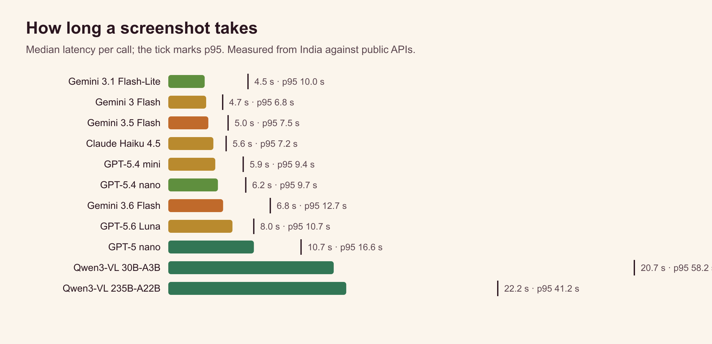

# Which AI model should read your fashion screenshots? We tested 11 of them.

*The Better Wardrobe team · 5 October 2026 · run `20261005-110457-a010`*

> **Small sample.** 100 images and 0 queries: treat differences of a few points as noise and read the ± intervals.

We are building the Discover tab of The Better Wardrobe: you share a screenshot of an outfit (an Instagram reel, a Pinterest pin, a celebrity look) or type what you want, and we find it, or something close, from Indian stores within your budget. Every search starts with a model turning pixels or words into structured attributes. This study tests only that first step, image understanding; finding products comes after it and is tested separately. Pick the wrong model and every result downstream is wrong, or the bill explodes, so we tested the candidates on our own images.

## What we found

- Best screenshot accuracy: Gemini 3.6 Flash at 95.0% ±0.9 ($5.01 per 1,000 calls).
- Not eligible for production: Gemini 3.6 Flash (named the person in 6.5% of celebrity images), Gemini 3 Flash (named the person in 6.7% of celebrity images). Best eligible model: Gemini 3.5 Flash at 90.8% ±3.0 ($11 per 1,000 calls).
- Good-enough pick: Gemini 3 Flash lands within 3 points of the best (94.7%) at $3.19 per 1,000 calls, 2× cheaper.
- Price is not quality: Claude Haiku 4.5 costs 5× more than GPT-5.6 Luna and scores lower (84.7% vs 86.1%).
- Best open-weights model: Qwen3-VL 235B-A22B at 72.2%, $1.64 per 1,000 calls.
- Reliability matters: Gemini 3.1 Flash-Lite failed 4% of calls (1 error, 3 invalid json); failures score zero.
- Hardest attributes across all models: brand visible (27%), fit (67%), fabric (70%). Easiest: ethnic (96%).
- Finding every item in a busy image is its own skill: best item recall was Gemini 3 Flash at 98.8%.

## Leaderboard: image understanding

| # | Model | Tier | Image understanding | Spots items | Names type | Describes | Search-ready | Failures | Named a person | $ / image | p50 latency |
|---|---|---|---|---|---|---|---|---|---|---|---|
| 1 | Gemini 3.6 Flash | Mid-high | 95.0% ±0.9 | 94.8% | 98.2% | 94.3% | 92.1% | 0% | 6.5% | $0.0050 | 6.8 s |
| 2 | Gemini 3 Flash | Mid-range | 94.7% ±2.0 | 98.8% | 98.4% | 93.5% | 91.3% | 1% | 6.7% | $0.0032 | 4.7 s |
| 3 | Gemini 3.5 Flash | Mid-high | 90.8% ±3.0 | 88.1% | 95.3% | 92.8% | 86.5% | 0% | 0.0% | $0.01 | 5.0 s |
| 4 | Gemini 3.1 Flash-Lite | Cheap | 89.3% ±3.8 | 93.1% | 98.1% | 91.9% | 88.4% | 4% | 0.0% | $0.0022 | 4.5 s |
| 5 | GPT-5.4 mini | Mid-range | 88.1% ±1.5 | 93.9% | 95.0% | 82.7% | 80.2% | 0% | 0.0% | $0.0043 | 5.9 s |
| 6 | GPT-5.6 Luna | Mid-range | 86.1% ±1.3 | 97.3% | 95.5% | 74.8% | 77.3% | 0% | 2.2% | $0.0012 | 8.0 s |
| 7 | Claude Haiku 4.5 | Mid-range | 84.7% ±1.7 | 90.5% | 94.5% | 80.2% | 72.2% | 0% | 0.0% | $0.0059 | 5.6 s |
| 8 | GPT-5.4 nano | Cheap | 82.0% ±2.2 | 94.4% | 92.2% | 71.4% | 73.9% | 1% | 0.0% | $0.0013 | 6.2 s |
| 9 | GPT-5 nano | Very cheap | 79.2% ±3.2 | 84.3% | 89.5% | 73.0% | 74.1% | 1% | 0.0% | $0.0005 | 10.7 s |
| 10 | Qwen3-VL 235B-A22B (open) | Very cheap | 72.2% ±5.8 | 71.4% | 76.1% | 73.2% | 70.8% | 1% | 0.0% | $0.0016 | 22.2 s |
| 11 | Qwen3-VL 30B-A3B (open) | Very cheap | 66.5% ±5.5 | 70.1% | 70.5% | 66.0% | 61.5% | 1% | 6.7% | $0.0007 | 20.7 s |

Image understanding = 25% spots every item + 25% names the product type + 30% describes its attributes + 20% search-ready phrasing, all compared against the answer key; failed calls score zero. Nothing is searched on the web. The ± is a 95% confidence interval across images. A model that names a person in more than 2% of celebrity images, or fails more than 2% of calls, is not eligible for production.

## How the answer key was made and checked

Nobody labelled these images by hand. Two strong models from different companies (gemini-3.1-pro and claude-sonnet-5.5) labelled every image independently and were left out of the test. An item counts only if both saw it; a field counts only if both agreed: they agreed on 92% of items and 70% of fields. Everything else is unscored. A third model from another company (gpt-5.6-terra) then checked 20 random images against the key: 100% of key items were really in the image and 98% of key fields were correct.

## Which model for the first 1,000 users, and after

At low volume the cost difference between models is a few dollars a month, so the best model is the right call. As volume grows, a cheaper model, or a cascade where a cheap model handles the easy images and passes the hard ones to a stronger one, gives up a few points to save most of the bill.

| Monthly image searches | Use | Score | Monthly cost | Best possible | Rule |
|---|---|---|---|---|---|
| Up to 1,000 image searches | Gemini 3.5 Flash | 90.8% | $11 | Gemini 3.5 Flash, 90.8%, $11 | Cost is a few dollars either way: buy the best quality. |
| 1,000–10,000 | GPT-5.4 mini | 88.1% | $43 | Gemini 3.5 Flash, 90.8%, $111 | Give up at most 3 points to save money. |
| 10,000–100,000 | GPT-5 nano → GPT-5.4 mini (escalate when unsure (confidence < 0.7)) | 86.9% | $412 | Gemini 3.5 Flash, 90.8%, $1105 | Cost dominates: give up at most 5 points. |

Cascades worth considering (diamonds on the chart):

| # | Cheap model → strong model | When to escalate | Images escalated | Score | $ / image |
|---|---|---|---|---|---|
| C1 | GPT-5 nano → Gemini 3.5 Flash | escalate when unsure (confidence < 0.7) | 84% | 88.4% | $0.0097 |
| C2 | GPT-5 nano → Gemini 3.5 Flash | escalate celebrity and ethnic looks | 33% | 84.4% | $0.0038 |
| C3 | GPT-5 nano → GPT-5.4 mini | escalate when unsure (confidence < 0.7) | 84% | 86.9% | $0.0041 |
| C4 | GPT-5 nano → GPT-5.4 mini | escalate celebrity and ethnic looks | 33% | 83.9% | $0.0019 |
| C5 | GPT-5.4 nano → GPT-5.4 mini | escalate celebrity and ethnic looks | 34% | 84.0% | $0.0027 |

By kind of extraction (best value = the cheapest model within 3 points of the best):

| Extraction | Best | Best value |
|---|---|---|
| Spotting every item | GPT-5.4 nano (94%) | GPT-5.4 nano (94%, $0.0013 / image) |
| Naming the product type | Gemini 3.5 Flash (95%) | GPT-5.4 mini (95%, $0.0043 / image) |
| Describing attributes | Gemini 3.5 Flash (93%) | Gemini 3.5 Flash (93%, $0.01 / image) |
| Search-ready phrasing | Gemini 3.5 Flash (87%) | Gemini 3.5 Flash (87%, $0.01 / image) |
| Images tagged celebrity | Gemini 3.5 Flash (94%) | Gemini 3.5 Flash (94%, $0.01 / image) |
| Images tagged accessories | Gemini 3.5 Flash (91%) | Gemini 3.5 Flash (91%, $0.01 / image) |
| Images tagged footwear | Gemini 3.5 Flash (96%) | Gemini 3.5 Flash (96%, $0.01 / image) |
| Images tagged mens-casual | Gemini 3.5 Flash (98%) | Gemini 3.5 Flash (98%, $0.01 / image) |
| Images tagged mens-ethnic | Gemini 3.5 Flash (96%) | Gemini 3.5 Flash (96%, $0.01 / image) |
| Images tagged mens-formals | GPT-5.4 mini (91%) | GPT-5.4 nano (89%, $0.0013 / image) |
| Images tagged womens-ethnic | GPT-5.4 mini (84%) | GPT-5.4 mini (84%, $0.0043 / image) |
| Images tagged womens-western | Gemini 3.5 Flash (95%) | Gemini 3.5 Flash (95%, $0.01 / image) |
| Images tagged everyday | Gemini 3.5 Flash (88%) | GPT-5.4 mini (87%, $0.0043 / image) |
| Images tagged graphic-tees | Gemini 3.5 Flash (92%) | GPT-5 nano (89%, $0.0005 / image) |

## Leaderboard: keyword understanding

_Not run._

Queries test what Indian shoppers actually type: Hinglish ("500 se kam"), rupee shorthand ("under 2k"), occasions (haldi, sangeet, farewell) and colour words (mustard, lal). We also check that models leave filters empty when the shopper did not ask for them, because an invented price or gender silently hides good results.

## Method

- **Data.** 100 images (everyday (54), celebrity (46), accessories (16), womens-ethnic (16), mens-casual (14), womens-western (13), footwear (12), mens-formals (12), graphic-tees (9), mens-ethnic (8)) and 0 queries (—), each scored against a fixed taxonomy (version 2026-10-01) and an AI consensus answer key (see below).
- **Task 1, screenshot.** One call per image returns every fashion item with its location, product type, 11 attributes (department, colour, pattern, sleeve, fit, length, neckline, fabric, occasion, Indian ethnic wear, visible brand) and the phrase a shopper would type to find it. Close answers get half credit (navy for black, loafers for formal shoes).
- **Task 2, keywords.** One call per query returns search filters (category, colour, occasion, rupee price range, size, brand, language).
- **Fairness.** Same prompt (version look-v3+query-v1), same JSON schema, temperature 0 where supported, images resized to 768px for everyone, low reasoning effort where configurable, 1 run per item.
- **Cost.** Billed tokens × list price (or the provider's reported cost), including reasoning tokens. Total spend for this study: $3.57.
- **Not tested here.** Finding the actual product. Attribute extraction is the first step; visual retrieval with image embeddings is measured separately.

## Where models struggle

| Image | Avg score across models | Type |
|---|---|---|
| celebrity-accessories-accessories-103 | 39.4% | celebrity, accessories |
| celebrity-womens-ethnic-womens-ethnic-079 | 60.0% | celebrity, womens-ethnic |
| celebrity-womens-ethnic-womens-ethnic-081 | 61.6% | celebrity, womens-ethnic |
| everyday-mens-formals-mens-formals-039 | 64.6% | everyday, mens-formals |
| everyday-womens-ethnic-womens-ethnic-071 | 67.7% | everyday, womens-ethnic |
| everyday-accessories-accessories-099 | 68.0% | everyday, accessories |
| everyday-accessories-accessories-090 | 68.8% | everyday, accessories |
| everyday-womens-ethnic-womens-ethnic-066 | 70.0% | everyday, womens-ethnic |

- **Qwen3-VL 235B-A22B** on `celebrity-mens-ethnic-mens-ethnic-063` (0%): missed black embroidered kurta; missed gold watch
- **Qwen3-VL 235B-A22B** on `celebrity-mens-formals-mens-formals-031` (0%): missed black blazer with checked lapels; missed black dress shirt; missed red and black striped tie; missed black formal trousers
- **GPT-5 nano** on `celebrity-womens-ethnic-womens-ethnic-079` (0%): missed multicolour embroidered kurta; missed sheer embroidered dupatta
- **Qwen3-VL 235B-A22B** on `celebrity-womens-ethnic-womens-ethnic-079` (0%): missed multicolour embroidered kurta; missed sheer embroidered dupatta
- **Qwen3-VL 235B-A22B** on `celebrity-womens-ethnic-womens-ethnic-080` (0%): missed pink embroidered anarkali suit; missed pink embroidered dupatta; missed gold jhumka earrings
- **Qwen3-VL 30B-A3B** on `celebrity-womens-ethnic-womens-ethnic-079` (0%): missed multicolour embroidered kurta; missed sheer embroidered dupatta

## What we are doing with this

We freeze the interfaces, not the vendors: the taxonomy, the prompt, the schema and the escalation rules stay fixed, and models are config. When prices or models change we re-run this suite and switch only if the numbers say so.

---
*Reproduce: `cd prototype && node evals/cli.mjs run --models very-cheap,cheap,mid,mid-high --repeat 1`. Notes from providers: none.*
